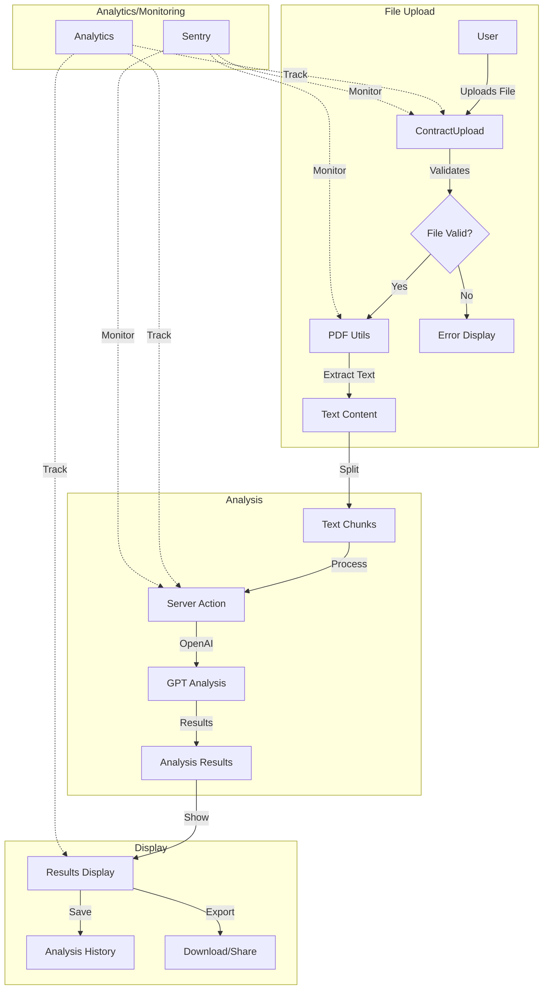
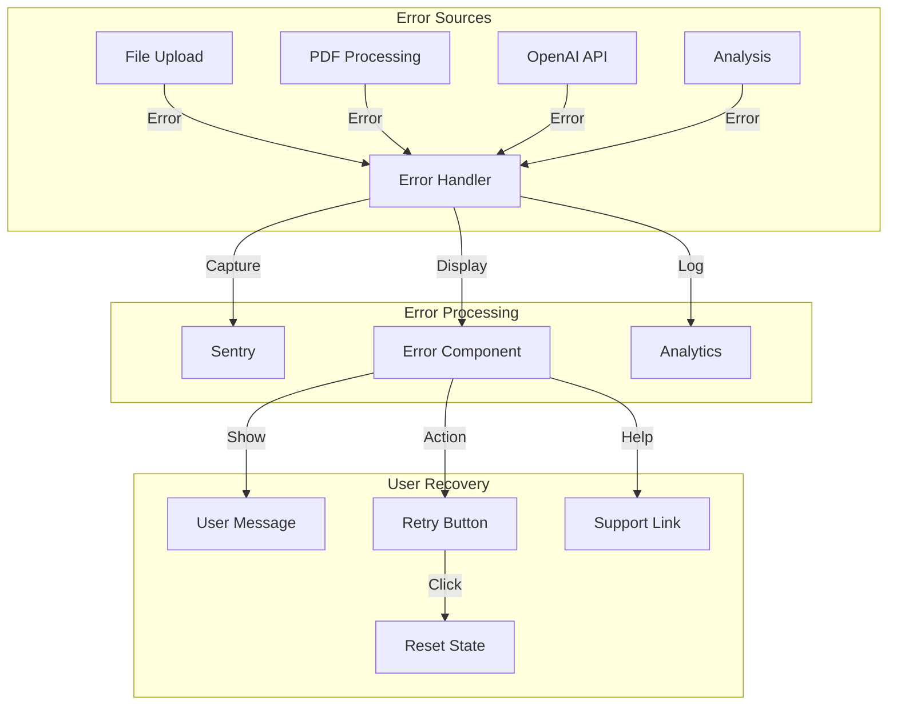
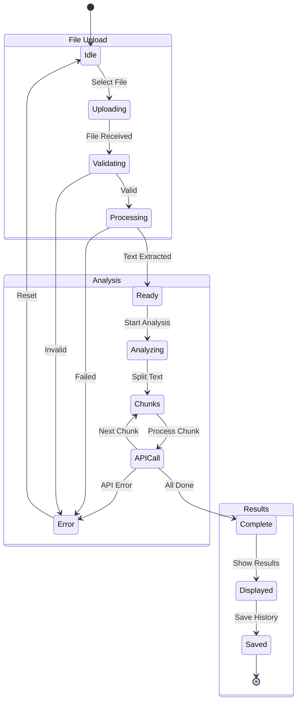

# DontSign Project Structure

## Directory Structure

[Previous directory structure content...]

## Application Flows

### Contract Analysis Flow

### Error Handling Flow

### State Management Flow

## Flow Descriptions

### Contract Analysis Flow
The main application flow for analyzing contracts:
1. User uploads a contract document
2. File is validated and processed
3. Text is extracted and chunked
4. Each chunk is analyzed by OpenAI
5. Results are compiled and displayed
6. Analysis is saved to history

### Error Handling Flow
Comprehensive error handling process:
1. Errors are caught from multiple sources
2. Processed through error boundaries
3. Tracked in Sentry and analytics
4. Displayed to user with recovery options
5. State is reset on retry

### State Management Flow
Detailed state transitions throughout the application:
1. Initial file upload and validation
2. Text processing and preparation
3. Chunk-based analysis process
4. Results display and storage
5. Error handling and recovery

[Rest of the previous content...]